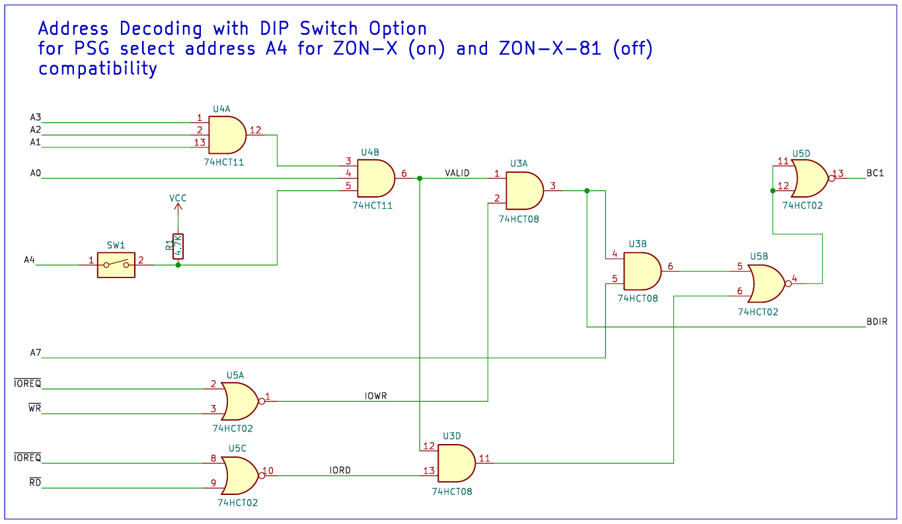

# 🔊AY-ZONIC-Core

AY-ZONIC-Core is a modular PSG interface designed for the ZX81, supporting both ZON-X and ZON-X-81 compatibility via simplified A4-only decode logic. Rev2.0 introduces gate economy, contributor-friendly schematic clarity, and expansion-ready I/O via AY-3-8912 Port A.

> **This project continues from [JonZON-X](https://github.com/Bambleweeny57/JonZON-X), which was closed at Rev1.4** after timing issues were discovered in demo playback. AY-ZONIC-Core retains the same A4-based decode logic but drops A5 and A6 simplifying the design to single PSG support and saving a gate.

## 🔧 Features

- **Dual-mode decode logic** via DIP switch:
  - **DIP OFF** → A4 pulled high → ZON-X-81 mode
  - **DIP ON** → A4 sourced from ZX81 Expansion Bus → ZON-X mode
- **AY-3-8912 PSG integration** with clean register selection and audio output
- **Series resistors** on data bus for signal protection
- **Pull-ups** from ZX81 Expansion Bus to PSG for stable logic levels
- **Port A expansion header** with +5V and GND for SD card and I/O experimentation
- **/RD decode support** for future peripheral interaction and PSG reads
### DIP Switch Logic — A4 Routing Modes

| DIP Switch | A4 Source             | Mode         | Description                                      |
|------------|-----------------------|--------------|--------------------------------------------------|
| OFF        | Pulled high (via pull-up) | ZON-X-81     | Forces A4 = 1 for simplified decode              |
| ON         | From ZX81 Expansion Bus  | ZON-X        | Enables dynamic A4 control from host             |

> This DIP-controlled logic allows seamless switching between ZON-X and ZON-X-81 compatibility without modifying the schematic.
> 
## 🧠 Decode Logic Overview

The schematic uses simplified A4-only address decoding, inherited from JonZON-X Rev1.4. By removing A5 and A6 from the decode path, Rev2.0 drops multi-PSG support in favor of gate economy and contributor clarity.

## 🖼️ Visual Decode Logic

### Decode Logic Explanation

The PSG is selected when:
- **A4 = 1** (via DIP or bus)
- **A7 = 1** (to avoid bus conflicts)
- **A2 = 1** (used internally by the PSG)
- **/IOREQ = 0** (active I/O cycle)
- **/WR and /RD** combinations determine the operation:
  - `/WR = 1`, `/RD = 1` → Write to register
  - `/WR = 0`, `/RD = 1` → Write to PSG
  - `/WR = 0`, `/RD = 0` → Read from PSG

> `/RD` is now decoded explicitly to support read operations from the PSG and future SD card and I/O interfaces.

### Reference — JonZON-X Rev1.4 Decode Matrix (A5/A6 omitted) for AY-ZONIC-Core

| A0–A4 | A2 | A7 | /IOREQ | /WR | /RD | BDIR | BC1 | Operation             |
|-------|----|----|--------|-----|-----|------|-----|------------------------|
| —     | 1  | 1  | 0      | 1   | 1   | 1    | 1   | Write to register      |
| —     | 1  | 1  | 0      | 0   | 1   | 0    | 1   | Write to PSG           |
| —     | 1  | 1  | 1      | 0   | 0   | 1    | 0   | Read from PSG          |
| —     | —  | —  | —      | —   | —   | 0    | 0   | Inactive               |

> Rev2.0 removes A5 and A6, streamlining the logic and focusing on single PSG support.

---

## 🔌 Expansion Header (Port A)

Port A of the AY-3-8912 exposes:
- **8 digital I/O lines** (AIO0–AIO7)
- **+5V** and **GND** for powering peripherals

This enables SD card interfacing, experimental I/O modules, and future expansion without modifying the core schematic.

### 🧵 AY-ZONIC-Core I/O Connector Pinout

| Pin | Signal | Description            |
|-----|--------|------------------------|
| 1   | 5V     | Power supply (5 volts) |
| 2   | A0     | Address line 0         |
| 3   | A1     | Address line 1         |
| 4   | A2     | Address line 2         |
| 5   | A3     | Address line 3         |
| 6   | A4     | Address line 4         |
| 7   | A5     | Address line 5         |
| 8   | A6     | Address line 6         |
| 9   | A7     | Address line 7         |
| 10  | GND    | Ground                 |

> This header is ideal for SD card experiments, LED arrays, or future playback logic modules. All signals are directly mapped from the AY-3-8912 Port A.

---

## 🗂️ Repository Structure

- `README.md` — This file
- `src/` — schematic and PCB design files (KiCad v9+)
- `pdf/ay-zonic-core.pdf` — Rev2.x schematic (KiCad source available from /src)
- `images/` — Decode logic diagram and overlays
- `fabfiles/` — Gerber and Exelon Drill fabrication files (coming soon)
- `docs/` — Contributor notes and onboarding diagrams (coming soon)

## 🧭 Contributor Notes

- Keep DIP switch logic annotated in overlays
- Label Port A lines clearly for expansion use
- Use series resistors and pull-ups as shown for safe bus interaction
- Future revisions may include playback logic or UI hooks — modularity is key

## 🛠️ Status

✅ Rev2.0 schematic complete  
🧪 Expansion header tested with SD interface  
📚 Documentation in progress

---

For questions, forks, or onboarding help, feel free to open an issue or start a discussion. Let the AY-3-8912 sing!
